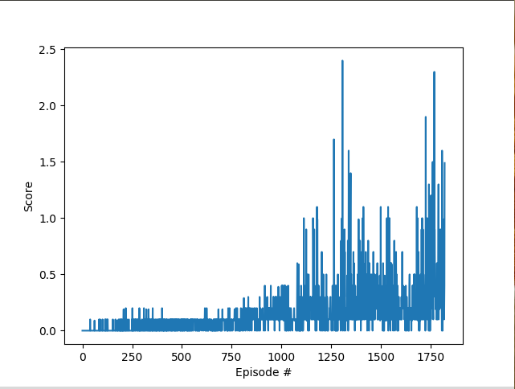

### Project 1: Navigation with DQN,Double DQN, Duelling DQN
This project involves training an agent to navigate (and collect bananas!) in a large, square world.
The result looked like this:

link to code: https://github.com/raoshashank/Navigation-using-DQN

### Project 2: Continouous control with DDPG
This project involves training a simulated robot arm to reach a particular given point.
The result looked like this:

link to code: https://github.com/raoshashank/Continouous-Control-with-DDPG

### Project 3: Collaboration and Competition
This project involves training a simulated robot arm to reach a particular given point.
The resulting Reward Progression looked like:

link to code: https://github.com/raoshashank/Tennis-with-MADDPG

